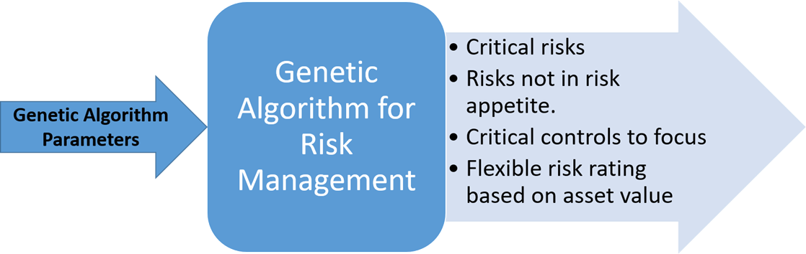
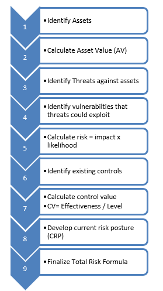
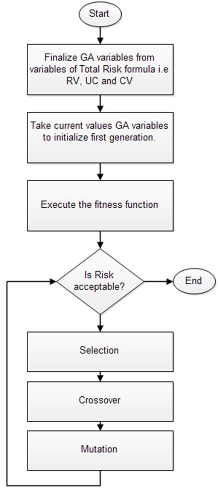

# Intelligent Risk Management using Artificial Intelligence 
You can download PDF version of the paper from [here](https://www.researchgate.net/profile/Osama-Hosam/publication/359362007_Intelligent_Risk_Management_using_Artificial_Intelligence/links/6239819e781d2e6df7ac2649/Intelligent-Risk-Management-using-Artificial-Intelligence.pdf?_sg%5B0%5D=gS7vCgowNoAegmgJZhC28cBVFYV6HrGubyMJ60Gyoy0vVi6QSxCooN1sAeCyc2wQPsD8HkiZ2wzHBCdsKVuwBw.w5f9avFGTOqZvUU3BHM-3pemiEL-eaM1rNm9hZcbXkS_WrLGjGupGDBSEeJ5mAIKbTn1mnux3-XbZ4OtwzKJPw&_sg%5B1%5D=491YA_zhA9PIvZkRESDGezgPL78v7RKC7av4ugpOZHtV29UFcmCP8PSClBqsFzdMWE9gGOJPYzG6FRKtZicQj1XMu0lUS3GwugeE1lEXJ0H8.w5f9avFGTOqZvUU3BHM-3pemiEL-eaM1rNm9hZcbXkS_WrLGjGupGDBSEeJ5mAIKbTn1mnux3-XbZ4OtwzKJPw&_iepl=). 

Cite this paper as 
_Hosam, O. (2022, February). Intelligent Risk Management using Artificial Intelligence. In 2022 Advances in Science and Engineering Technology International Conferences (ASET) (pp. 1-9). IEEE.‏_
## Abstract
Effective information security risk management is essential for survival of any business that is dependent on IT. In this paper we present an efficient and effective solution to find best parameters for managing cyber risks using artificial intelligence. Genetic algorithm is use as it can provide our required optimization and intelligence. Results show that GA is professional in finding the best parameters and minimizing the risk.

## INTRODUCTION
Emerging technologies has transformed the business era. That transformation has multiplied the number of cyber-attacks. Risk management is playing pivotal role in ensuring organizations continue to survive in today competitive market. Organizations are investing huge amount for protection from cyber-attacks and making their systems secured. In the fast-paced IT world business often focus extensively on their profit serving processes resulting in losing sight of emerging risks. Risk Management itself is a time taking process that requires frequent monitoring and excellent expertise for efficient execution. In large and medium sized organizations, the scope of risk management is enormous. The ever-growing dependency of business processes on IT systems as resulted in growing threats that result in significant risks which have the capability to hamper any business activity at any time. Importance of risk management is also emphasized by growing number of information security standards and stringent government regulations like HIPPA, GDPR, NESA and SAMA CSF etc.
Artificial intelligence is providing answers to problems that were previously unanswered or had cumbersome solutions. Artificial intelligence is a branch of computer science that emphasizes the development of computer systems that can think logically through reasoning, are adaptable to changing environment and can evolve over time.

Genetic algorithm (GA) approach was selected taking into consideration its efficiency while solving tasks with large solution space and ability to model the evolution process which is the case for risk management multiple scenarios, often considered as a form of artificial life, evolution forecasting. 
The proposed algorithm considers the GA as a third-party tool to help risk analyst to get the best parameters that minimizes risk. The proposed algorithm starts by calculating risk manually. If the analyst is not satisfied by the result, he/she will use GA to find the best parameters that minimizes the risk. 
This paper is divided into several sections. The related work is discussed in section 2 along with brief of relevant research. Section 3 discuss the background of our research and established our platform. In section 4 we present our hybrid design and its working methodology. Section 5 elaborates how it is implemented and the deliverables.

## THE PROPOSED APPROACH
Prior to explanation of design presented in this paper it is mandatory to understand the key advantage of the proposed design.
As shown in the following figuer, the presented design takes various risk assessment values as genetic algorithm variables and after processing deliver parameters that are essential for maintaining risks under control in any type of business environment.
Risk assessment exercise is performed to get information that can be used as input for genetic algorithm. 



The risk assessment procedure is shown in the following figure. A comprehensive asset inventory should be available against which risk assessment will be performed and are part of risk assessment scope.



Once asset inventory is developed it is pivotal to evaluate the value of asset. Asset Value (AV) can be calculated using quantitative or qualitative methods. In quantitative process various techniques such as net present value, dollar value to business etc. can be calculated. This is a resources intensive and mathematically complex process as the number of assets increase along with data with diverse classification levels. Whereas qualitative Asset Value (AV) only determines the criticality of an asset on various scales normally in the range of 1-5, with 5 being very critical.  
The threats for each specific asset should be identified. Threats such as software threats, theft, natural causes, etc. The corresponding vulnerabilities also should be identified. The threats can exploit the vulnerability to make an attack and put the asset in a high risk. For example, if a computer PC is the asset, the threat can be a virus and the vulnerability can be something like not installing an antivirus on the computer. Not installing an anti-virus puts the PC at a high risk. The risk is then calculated by using the impact and likelihood. The impact calculates how much losses occurred due to the threat exploitation. The likelihood calculates how probable the occurrence of such threat exploitation. The likelihood is easily calculated from the historical records of previous exploits.  For example, if the asset is database server. The impact is very high, since attacking the database server means losing customer contacts and financial sensitive data. The likelihood is calculated by counting how many times the database server faced an attack during the last year. 
The next step is to define the existing control for mitigating such risk. The control value is calculated by dividing the control effectiveness over the control level. The current risk posture can be judged due to the control value and the calculated risk. Finally, the total risk is calculated. 
Algorithm 1 shows the proposed GA algorithm. It takes as an input, the Asset Value (AV), Impact (IM), Likelihood (LH), Uncertainty (UC), and Control Value (CV). The risk is then calculated by using the following formula:

_Risk=(AV x IM x LH) + (AV x IM x LH) x UC – CV 	(1)_

After applying GA for calculating the best parameters to minimize the risk in equation 1, we get the fitness function with optimal parameters. 

**Algorithm 1: Risk Value Calculation**
```
Input: Asset Value (AV), Impact (IM), Likelihood (LH), Uncertainty (UC), Control Value (CV)  .
Output: Fitness Functon with optimal parameters.
Formula: 
Risk = (AV x IM x LH) + (AV x IM x LH) x UC – CV
Where CV = Control Effectiveness / Control Level 

```

The algorithm is detailed in the flow chart in the following The resulting parameters are passed to the formula in equation 1. If the calculated risk is minimized enough, then no need for GA. If the calculated risk is not minimized, then the GA procedure is applied to minimize the risk. 
GA algorithm starts by assigning solutions called chromosomes. It creates a collection of chromosomes in a bigger population. The selection procedure is applied to select the best chromosomes that will survive to the next generation.  
Next, GA makes a crossover to the chromosomes. Crossover means switching parts between chromosomes. That will add more chromosomes to the population. The last step is mutation, which means switching randomly parts of the chromosomes (genes) that will also creates new chromosomes and add them to the population. GA will start over again and return to the selection phase if the existing chromosomes are not suitable to minimize the risk.  Otherwise, the algorithm will end. 



## CONCLUSION
This paper utilizes the intelligence of genetic algorithms to calculate risks based on complex combinations of assets, threats, vulnerabilities, and controls. Results showed that using Genetic algorithm to help in risk assessments lead to higher accuracy in risk assessment and hence increased the ability of organizations to better deal with unexpected threats. Future work based on presented concept can develop intelligent software unleashing the power of artificial intelligence to automate risk management process for large enterprises. 

Cite this paper as 
_Hosam, O. (2022, February). Intelligent Risk Management using Artificial Intelligence. In 2022 Advances in Science and Engineering Technology International Conferences (ASET) (pp. 1-9). IEEE.‏_
